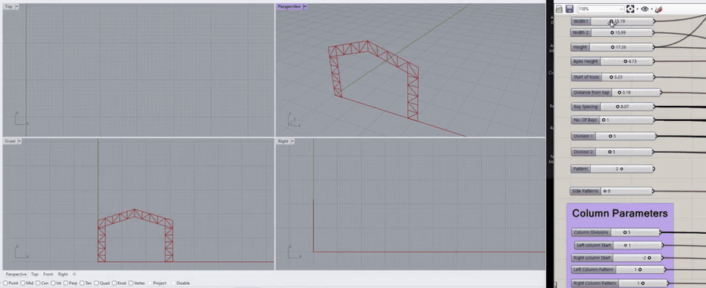
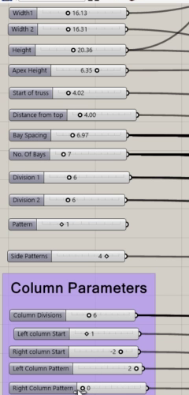
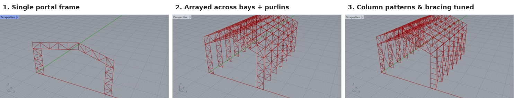
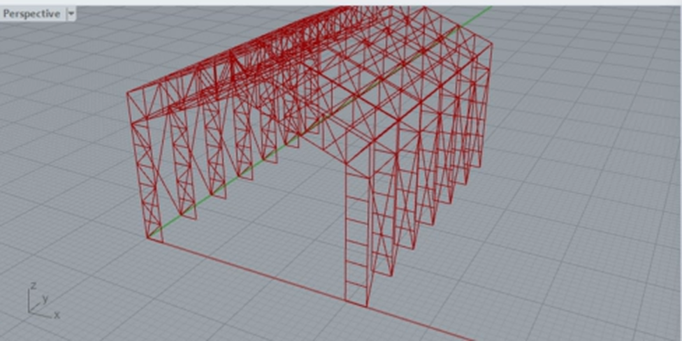
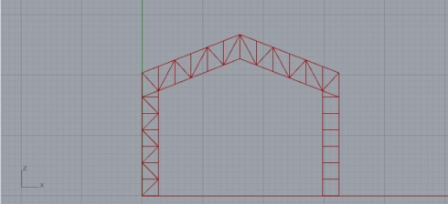
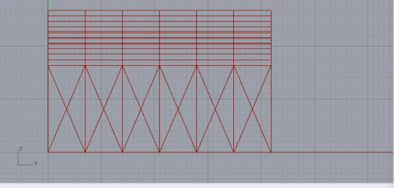
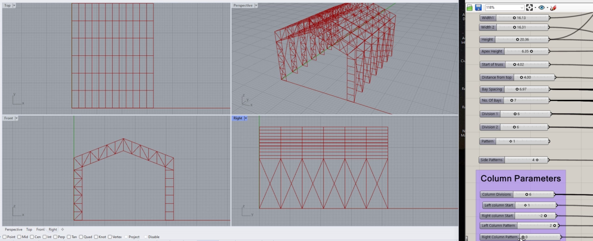

# Parametric Pre-Engineered Building (PEB) — Grasshopper + Karamba3D

A fully parametric steel pre-engineered building, modelled in Rhino/Grasshopper and set up for structural analysis in Karamba3D. Change a handful of sliders (spans, heights, number of bays) and the complete structural system — lattice columns, trusses, purlins and bracing — regenerates, gets assigned cross-sections, supports and loads, and is carried through Revit into Robot Structural Analysis for analysis and design.



*Sliders on the right drive the structure live in Rhino (video sped up 6×). [Watch the full walkthrough](HowToUseScriptToModelStructure.mp4).*

---

## Why this project

Pre-engineered buildings are repetitive by nature, which makes them ideal for parametric design. Instead of redrawing a frame for every bay or span change, this definition treats the building as a set of rules. The goal was a workflow that goes from **parametric model → Revit → Robot Structural Analysis** without manual remodelling, cutting the modelling of a full PEB down to minutes.

## What it does

**Geometry generation.** The building is driven by seven inputs: eave height, two span widths, apex height, number of bays, bay spacing and column divisions. From these, the definition builds the gable profile, divides it, and generates every member line.

**Structural system.** The frame is made of built-up lattice columns (vertical members, horizontal members, alternating left/right diagonal patterns) and roof trusses (top/bottom chords, vertical posts, diagonals), tied together along the length of the building by purlins and bracing. Diagonal patterns are produced with list dispatch, shift and cull logic rather than drawn by hand.

**Analytical model (Karamba3D).** Lines are converted to beams and grouped into eight element sets, each with its own cross-section family:

| Element set | Role |
|---|---|
| `C_Vertical`, `C_Horizontal`, `C_Diagonal` | Lattice column members |
| `C_Bracing` | Column bracing |
| `T_Chord`, `T_Post`, `T_Diagonal` | Roof truss members |
| `UPurlins` | Roof purlins |

Supports are applied at the column bases, and loads include self-weight (gravity) and a surface load applied to the roof nodes. Buckling lengths and beam-joint (hinge) conditions are defined on the elements.

**Interoperability.** The model is exported to **IFC** (via GeometryGym) and brought into **Revit**, where properties and materials are assigned. From Revit it goes to **Robot Structural Analysis** for analysis and design.

## Parameters



**Frame geometry**

| Input | Description |
|---|---|
| Width 1, Width 2 | Span widths either side of the apex |
| Height | Eave / column height |
| Apex Height | Ridge height above the eave |
| Start of truss, Distance from top | Where the roof truss meets the column |
| Bay Spacing, No. of Bays | Frame spacing and count along the building |
| Division 1, Division 2 | Truss panel divisions on each slope |
| Pattern, Side Patterns | Truss web and side-wall bracing patterns |

**Column parameters**

| Input | Description |
|---|---|
| Column Divisions | Number of panels in each lattice column |
| Left / Right column Start | Offset where each column's diagonal pattern begins |
| Left / Right Column Pattern | Diagonal pattern type for each column |

<br clear="right">

## Build sequence



1. **Inputs**: dimension and pattern sliders
2. **Truss generation**: chords, posts, diagonals
3. **Column generation**: lattice columns with independent left/right diagonal patterns
4. **Longitudinal system**: frames arrayed along the bays, then purlins and side-wall bracing
5. **Karamba3D**: beams, cross-sections, materials, supports, loads, model assembly
6. **Export**: IFC → Revit (properties, materials) → Robot Structural Analysis (analysis and design)

## Results



| Front elevation | Side elevation (bracing) |
|---|---|
|  |  |

<!-- Next upgrade: add Karamba Analyze + Utilization and show deflection / utilisation screenshots here,
     e.g. "Max deflection: XX mm (limit L/XXX)", "Max utilisation: XX %" -->



## Requirements

- Rhino 7 + Grasshopper *(update if you used a different version)*
- [Karamba3D](https://www.karamba3d.com/) 2.2.0
- [GeometryGym](https://geometrygym.wordpress.com/) ggRhinoIFC 2.2.8 and ggKarambaGHA 0.2.9 (only needed for IFC export)
- Autodesk Revit and Robot Structural Analysis (for the downstream workflow)

## How to run

1. Install the plugins above.
2. Open Rhino, launch Grasshopper, and open `PRE ENGINEERED BUILDING.gh`.
3. Adjust the sliders in the **Inputs** group.
4. Before exporting, set the file path on the IFC export component to a folder on your machine.
5. Import the IFC into Revit, assign properties and materials, then send the model to Robot Structural Analysis.

## Repository structure

```
├── PRE ENGINEERED BUILDING.gh            # Grasshopper definition
├── HowToUseScriptToModelStructure.mp4    # Walkthrough video
├── images/                               # Demo GIF, renders, elevations, sliders
├── exports/                              # Sample IFC output (optional)
└── README.md
```

## Skills demonstrated

Parametric modelling · Grasshopper data-tree management · Computational structural design · Karamba3D (FE model setup) · Steel structures (PEB) · BIM interoperability (IFC) · Autodesk Revit · Robot Structural Analysis